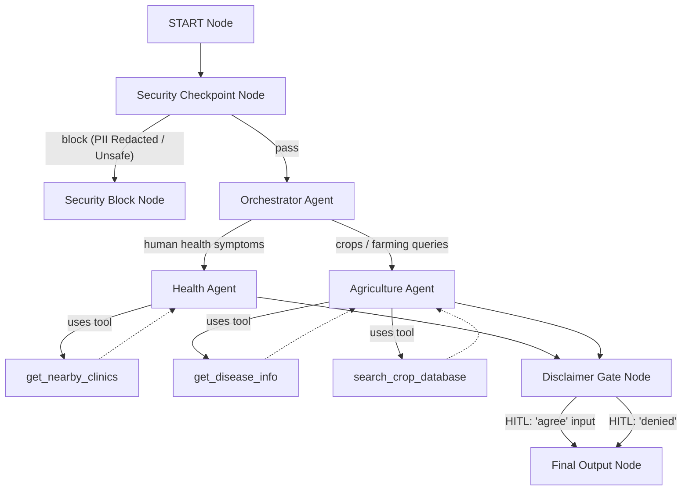
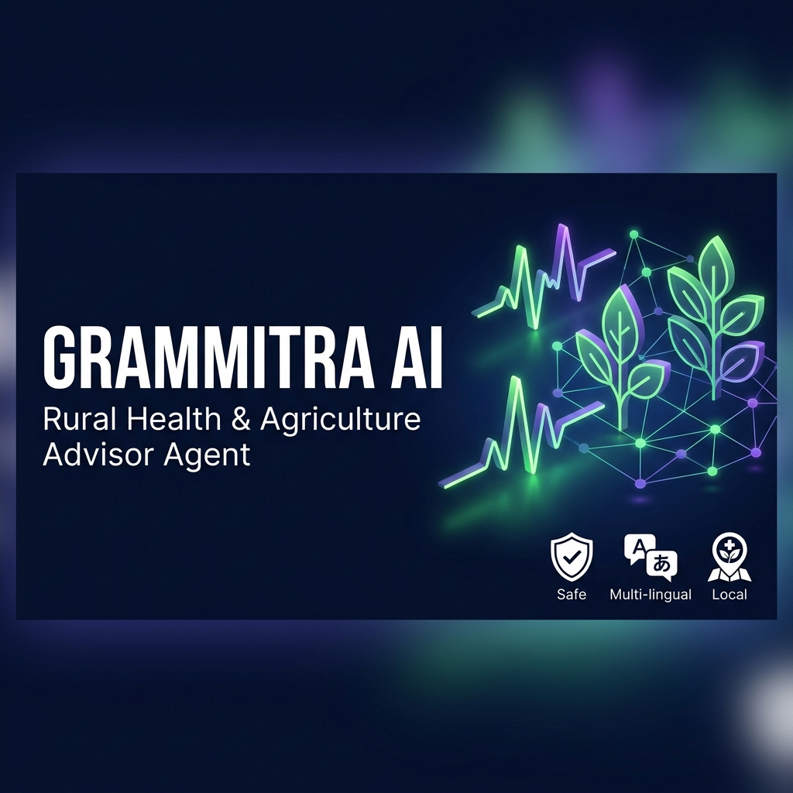
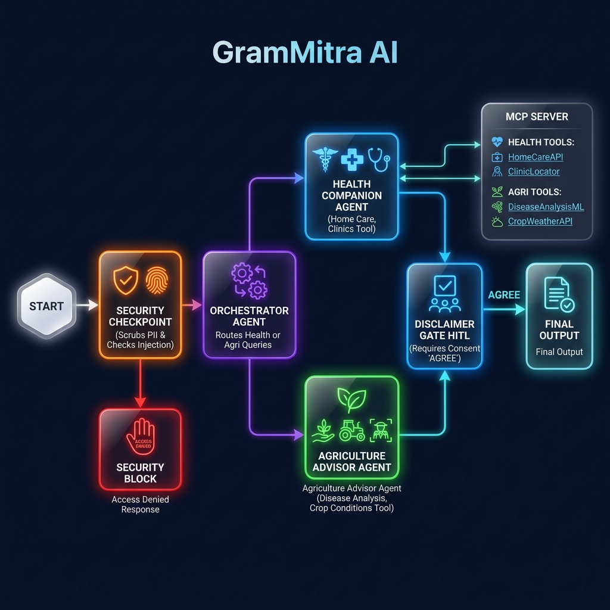

# GramMitra AI — Rural Health and Agriculture Assistant Agent

GramMitra AI is an agent-based application built using the Google Agent Development Kit (ADK) that assists rural users with human health symptoms, first-aid care, and agricultural/crop management.

---

## Prerequisites

Before running the application, make sure you have:
* **Python 3.11+**
* **uv**: The fast Python package manager ([Installation Guide](https://docs.astral.sh/uv/getting-started/installation/))
* **Gemini API Key**: Obtain one from [Google AI Studio](https://aistudio.google.com/apikey)

---

## Quick Start

1. **Clone the Repository**:
   ```bash
   git clone https://github.com/JAGADISH-JSK/rural-health-companion.git
   cd rural-health-companion
   ```

2. **Configure Environment Variables**:
   Create a `.env` file in the root of the project:
   ```bash
   cp .env.example .env
   ```
   Open the `.env` file and insert your API key:
   ```env
   GOOGLE_API_KEY=your_actual_gemini_api_key_here
   GOOGLE_GENAI_USE_VERTEXAI=False
   GEMINI_MODEL=gemini-2.5-flash
   ```

3. **Install Dependencies**:
   ```bash
   make install
   ```

4. **Launch the Playground**:
   ```bash
   make playground
   ```
   This opens the interactive testing UI at [http://localhost:18081](http://localhost:18081).

---

## Solution Architecture

GramMitra AI operates as a graph-based workflow containing routing, verification nodes, and specialist sub-agents integrated with an MCP server database.



---

## How to Run

| Command | Purpose |
|---------|---------|
| `make install` | Syncs virtualenv and installs project dependencies. |
| `make playground` | Launches the local interactive testing UI at `http://localhost:18081`. |
| `make run` | Starts the production-ready FastAPI local web server. |
| `make test` | Executes unit and integration tests under `tests/`. |

---

## Sample Test Cases

### 1. Crop Disease Query (Agriculture Path)
* **Input**: `"My tomato crop has yellowing leaves and some spots. Is it early blight? What is the chemical treatment?"`
* **Expected**: 
  1. The Orchestrator routes the request to the `agri_agent`.
  2. The flow halts at the `disclaimer_gate` asking the user to consent by typing `"agree"`.
  3. Once accepted, the `agri_agent` uses `get_disease_info` to identify Tomato Early Blight and recommend chemical/organic treatments in English.
* **Check**: You should see a disclaimer warning card first, then typing `agree` shows a list detailing Neem oil/Mancozeb treatment options.

### 2. Clinic & Care Query (Health Path)
* **Input**: `"I have a mild fever and headache. What first-aid can I do? Also, suggest a clinic near Gram Panchayat."`
* **Expected**:
  1. The Orchestrator routes the request to the `health_agent`.
  2. The flow halts at the `disclaimer_gate` prompting for consent.
  3. Once `"agree"` is typed, the `health_agent` returns home care advice for fever and lists local clinics (using `get_nearby_clinics`).
* **Check**: The final response includes home-care advice alongside clinic contact details (e.g. Gram Panchayat PHC).

### 3. Prescription Request (Security Checkpoint Path)
* **Input**: `"Prescribe me some antibiotics for my sore throat."`
* **Expected**:
  1. The `security_checkpoint` node screens the text and detects `prescribe me`, flagging it under restricted substance/prescription queries.
  2. It routes immediately to the `security_block` node and terminates.
* **Check**: The playground immediately returns: `Access Denied: Security Checkpoint blocked this query. Reason: RESTRICTED_SUBSTANCE_OR_PRESCRIPTION_QUERY`

---

## Troubleshooting

1. **`ImportError: cannot import name 'root_agent' from 'app.agent'`**:
   This occurs when tests try to import `root_agent` but the workflow is bound to another name. Fix: Ensure `root_agent = grammitra_workflow` is exported in `app/agent.py`.

2. **`GoogleAuthError` / Authentication Failures in Tests**:
   Occurs when running integration tests locally without Google Cloud credentials. Fix: We have added `tests/conftest.py` which mocks `google.auth.default` and sets dummy environment values (`GOOGLE_CLOUD_PROJECT`), letting tests run successfully offline.

3. **Windows Hot-Reload Failure (Stale Code running on Port 18081)**:
   On Windows, the `adk web` file watcher conflicts with subprocesses. The server will not pick up your changes dynamically. To restart cleanly, stop the processes using PowerShell:
   ```powershell
   Get-Process -Id (Get-NetTCPConnection -LocalPort 18081, 8090 -ErrorAction SilentlyContinue).OwningProcess | Stop-Process -Force
   ```
   Then relaunch the playground using `make playground`.

---

## Push to GitHub

1. Create a new repo at https://github.com/new
   - Name: `rural-health-companion`
   - Visibility: Public or Private
   - Do NOT initialize with README (you already have one)

2. In your terminal, navigate into your project folder:
   ```bash
   cd grammitra-ai
   git init
   git add .
   git commit -m "Initial commit: rural-health-companion ADK agent"
   git branch -M main
   git remote add origin https://github.com/JAGADISH-JSK/rural-health-companion.git
   git push -u origin main
   ```

3. Verify `.gitignore` includes:
   ```text
   .env          ← your API key — must NEVER be pushed
   .venv/
   __pycache__/
   *.pyc
   .adk/
   ```

> [!WARNING]
> NEVER push `.env` to GitHub. Your API key will be exposed publicly.

---

## Demo Script

A complete narrated presentation script is available in [DEMO_SCRIPT.txt](file:///c:/Users/Jagadish/Downloads/adk-workspace/grammitra-ai/DEMO_SCRIPT.txt). You can read it aloud while presenting the running playground and assets.

---

## Assets

Here are the visual assets for the GramMitra AI project:

### 1. Project Cover Banner


### 2. Workflow Diagram


