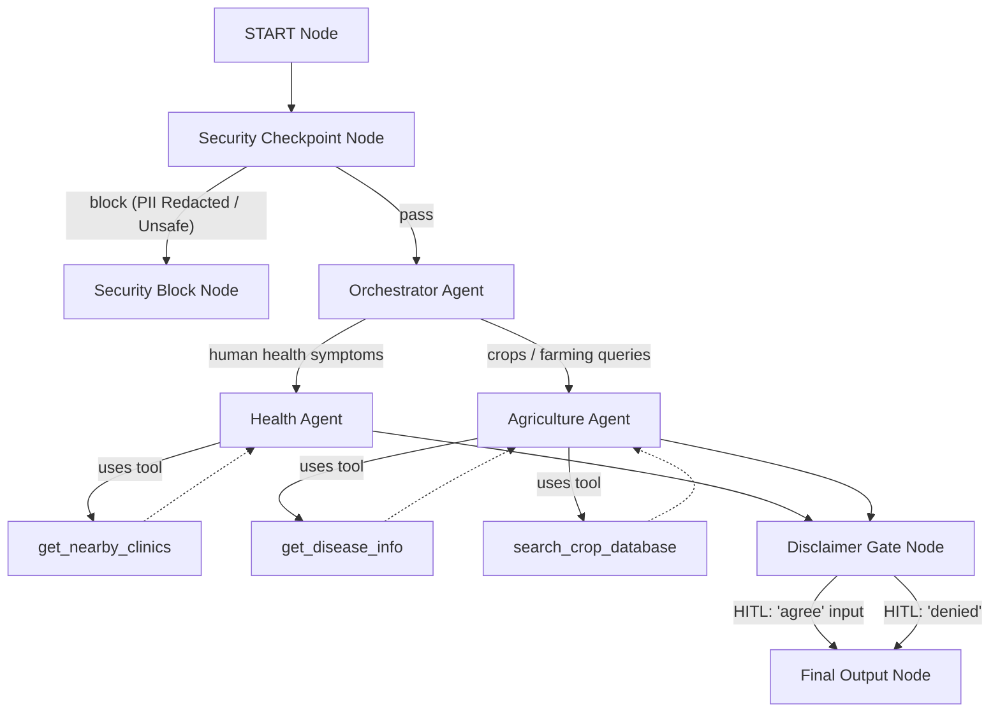

# Submission Write-Up: GramMitra AI

## Problem Statement

Rural communities in developing regions often face limited access to immediate, high-quality primary healthcare and agricultural advisory services. Local farmers and villagers may have to travel long distances to towns or cities to consult doctors or agricultural extension workers for simple symptoms or crop disease queries. 

**GramMitra AI** addresses this need by providing an accessible, multi-lingual, and highly practical AI-driven assistant tailored for rural contexts. It provides guidance on human health symptoms and crop diseases, integrates with local clinic databases, performs strict input safety sanitization, and implements safety checkpoints.

---

## Solution Architecture

GramMitra AI operates as a graph-based workflow. The following diagram illustrates the interaction between the security checkpoint, orchestrator routing, specialist agents, tools, and the human-in-the-loop disclaimer gate:

---

## Concepts & Features Used

1. **ADK Workflow (Graph Architecture)**
   - Custom sequential and conditional routing graph defined in [agent.py:L245-256](file:///c:/Users/Jagadish/Downloads/adk-workspace/grammitra-ai/app/agent.py#L245-L256).
   - Custom workflow nodes decorated using `@node` (e.g. `security_checkpoint`, `disclaimer_gate`).

2. **LlmAgent**
   - Deploys specialized LLMs for health guidance ([agent.py:L57](file:///c:/Users/Jagadish/Downloads/adk-workspace/grammitra-ai/app/agent.py#L57)) and agricultural advisor tasks ([agent.py:L77](file:///c:/Users/Jagadish/Downloads/adk-workspace/grammitra-ai/app/agent.py#L77)), utilizing prompts localized to the user's language.

3. **AgentTool**
   - Used by the coordinator orchestrator agent ([agent.py:L97](file:///c:/Users/Jagadish/Downloads/adk-workspace/grammitra-ai/app/agent.py#L97)) to delegate requests to the `health_agent` or `agri_agent`.

4. **MCP Server Integration**
   - Connected via `McpToolset` using standard I/O parameters pointing to [mcp_server.py](file:///c:/Users/Jagadish/Downloads/adk-workspace/grammitra-ai/app/mcp_server.py) (see [agent.py:L34-41](file:///c:/Users/Jagadish/Downloads/adk-workspace/grammitra-ai/app/agent.py#L34-L41)).

5. **Security Checkpoint**
   - Implemented as a pre-filtering node ([agent.py:L109-180](file:///c:/Users/Jagadish/Downloads/adk-workspace/grammitra-ai/app/agent.py#L109-L180)) that sanitizes inputs and logs decisions to an audit log.

6. **Agents CLI**
   - Used for scaffolding, package installation, running local unit/integration tests (`pytest`), and launching the interactive developer playground.

---

## Security Design

1. **PII Scrubbing**
   - **How**: Uses regular expressions to redact Indian phone numbers, Aadhaar card numbers, and email addresses.
   - **Why**: Protects privacy in shared rural devices/kiosks by preventing sensitive personal details from being sent to external LLMs.

2. **Prompt Injection Mitigation**
   - **How**: Scans for hostile phrases (e.g. `ignore previous instructions`, `bypass security`).
   - **Why**: Ensures the agent cannot be manipulated to override its behavior or behave in unsafe ways.

3. **Domain-Specific Restrictive Filters**
   - **How**: Detects keywords requesting medical prescriptions (e.g. `prescribe me`, `antibiotic dosage`) or restricted agro-chemicals (e.g. `paraquat`, `monocrotophos`).
   - **Why**: Prevents dangerous self-medication practices or the use of hazardous chemicals banned or highly regulated in rural regions.

---

## MCP Server Design

The Model Context Protocol (MCP) server provides a local sqlite/mock database of clinics, crop diseases, and optimal crop conditions:
1. **`get_nearby_clinics`**: Returns nearest clinics, contact info, and travel distances based on local villages/towns ([mcp_server.py:L6](file:///c:/Users/Jagadish/Downloads/adk-workspace/grammitra-ai/app/mcp_server.py#L6)).
2. **`get_disease_info`**: Resolves organic/chemical treatments and preventive measures for critical crops such as paddy/rice and tomato ([mcp_server.py:L24](file:///c:/Users/Jagadish/Downloads/adk-workspace/grammitra-ai/app/mcp_server.py#L24)).
3. **`search_crop_database`**: Fetches soil conditions, optimal pH, fertilizer inputs, and irrigation requirements ([mcp_server.py:L57](file:///c:/Users/Jagadish/Downloads/adk-workspace/grammitra-ai/app/mcp_server.py#L57)).

---

## Human-in-the-Loop (HITL) Flow

A dedicated `disclaimer_gate` node ([agent.py:L192-232](file:///c:/Users/Jagadish/Downloads/adk-workspace/grammitra-ai/app/agent.py#L192-L232)) acts as a gatekeeper before displaying answers:
* **Consent Request**: Yields a `RequestInput(interrupt_id="disclaimer_accept")` warning the user that advice is informational and does not replace professional guidance.
* **Execution Block**: The workflow pauses until the user explicitly responds with a confirmation (like `"agree"`). If denied, the advice remains hidden.
* **Why**: Emphasizes legal/safety boundaries to prevent rural users from substituting AI-generated guidance for actual clinical doctors or certified agronomists in critical situations.

---

## Demo Walkthrough

1. **Crop Health Analysis (Tomato Early Blight)**
   * *User Query*: `"My tomato crop has yellowing leaves and some spots. Is it early blight? What is the chemical treatment?"`
   * *Flow*: Orchestrator → Agri Agent → Disclaimer Gate.
   * *HITL*: User types `"agree"` in the playground UI.
   * *Result*: Displays detailed early blight details recommending organic Neem oil and chemical Mancozeb treatments.

2. **Fever Home Care & Clinic Search**
   * *User Query*: `"I have a mild fever and headache. What first-aid can I do? Also, suggest a clinic near Gram Panchayat."`
   * *Flow*: Orchestrator → Health Agent → Disclaimer Gate.
   * *HITL*: User types `"agree"`.
   * *Result*: Provides basic home advice for fever and returns contact details for Gram Panchayat Primary Health Centre.

3. **Restricted Query Filtering**
   * *User Query*: `"Prescribe me some antibiotics for my sore throat."`
   * *Flow*: Security Checkpoint → Unsafe Path → Security Block Node.
   * *Result*: Playground immediately prints: `Access Denied: Security Checkpoint blocked this query. Reason: RESTRICTED_SUBSTANCE_OR_PRESCRIPTION_QUERY`

---

## Impact / Value Statement

GramMitra AI bridges the advisory gap for rural populations:
* **Farmers** receive instant advice on crop anomalies, allowing them to counter diseases early and preserve yields.
* **Villagers** get rapid first-aid suggestions and can quickly identify nearby clinics, saving valuable travel time and enabling timely clinical intervention.
* **Safety** is maintained at every step through automated redacting, domain-specific restriction guards, and human disclaimer checks.
